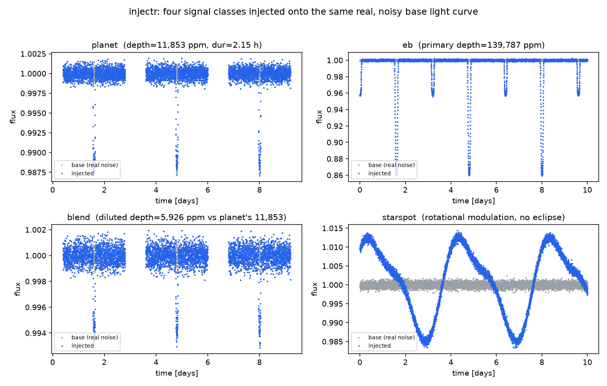
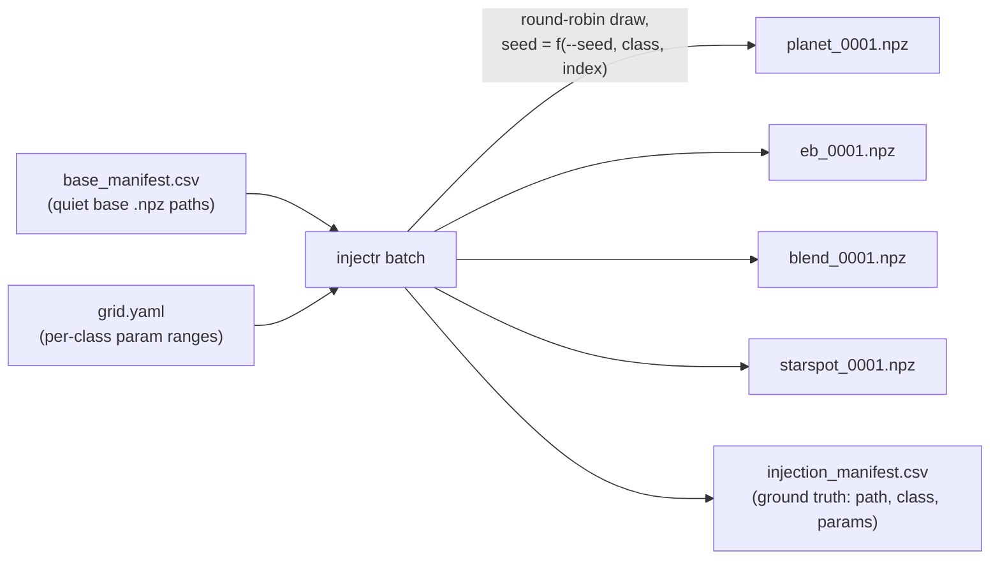

# injectr

<p align="center">
  
  
  
  
</p>

Injects a synthetic transit/EB/blend/starspot signal into a **real, already-processed
light curve** — the noise stays real, only the signal is synthetic. Its whole purpose is
producing ground-truth-labeled data for injection-recovery testing: run your pipeline on
injectr's output and measure whether the known injected class/parameters come back out,
where recovery starts failing as a function of SNR/depth/period, and what your
false-positive rate looks like when nothing was injected at all.

This is deliberately different from tools that build fixtures from a synthetic time grid
plus synthetic noise from scratch. Real stellar noise (red noise, gaps, systematics,
whatever your real target actually looks like) is a much harder and more honest canvas
than white noise drawn from a Gaussian — the same "real data over synthetic for fixtures"
principle, extended to injection-recovery.



All four panels above share the exact same base light curve (a synthetic
stand-in with the same white+red noise shape `injectr`'s own test fixtures
use — gray points in every panel) and the same `seed`-derived randomness for
reproducibility. Only the injected signal (blue) differs: `planet` is a
single periodic dip, `eb` is a much deeper primary eclipse with a fainter
secondary visible mid-cycle, `blend` is the same planet geometry as the
first panel but with 50% third-light dilution roughly halving its apparent
depth (`5,926 ppm` vs. `11,853 ppm` — this is exactly the kind of
attenuated signal `fitr`'s `blend` vs. `planet` ambiguity check exists to
catch), and `starspot` has no eclipse at all — just smooth rotational
modulation, since it's the "this looks periodic but isn't a transit"
negative-control class.

## Install

`injectr` isn't published to PyPI — install straight from GitHub:

```bash
pip install git+https://github.com/nikhilcherry/injectr
```

Never `pip install injectr` — the bare name isn't ours on PyPI and may be squatted.

## Quickstart

### Python API

```python
import injectr

result = injectr.inject_planet(
    base_path="data/processed/null/tic123.npz",
    period=5.2, rp=0.05, t0=0.3, a=15.0, inc=89.0,
    seed=42,
)
result.time            # base file's own time array, unchanged
result.flux            # base flux * transit model, real noise preserved
result.flux_err        # copied from the base file unchanged
result.label            # "planet"
result.injection_params  # {"class": "planet", "period": 5.2, "rp": 0.05, "t0": 0.3,
                          #  "a": 15.0, "inc": 89.0, "u": [0.4, 0.25]}
result.injected_depth_ppm       # measured from the model's own minimum flux
result.injected_duration_hours  # analytic T14 duration

result.to_npz("data/injected/planet_0001.npz")
# writes a schema-1.0-compliant file: augmented=True, injection_params=<dict above>,
# label="planet", time/flux/flux_err from the injection, tic_id/sector/mission carried
# over from the base file unchanged.
```

The equivalent functions for the other three classes have the same shape:

```python
injectr.inject_eb(base_path, period, rp, t0, a, inc, secondary_scale, seed=...)
injectr.inject_blend(base_path, period, rp, t0, a, inc, dilution, seed=...)
injectr.inject_starspot(base_path, prot, amp1, amp2, phase1, phase2, seed=...)
```

`inject_blend`'s forward model is the planet model with an extra free `dilution`
parameter: `flux = 1 - dilution * (1 - transit_flux)`. `inject_starspot` has no eclipse,
so `injected_depth_ppm`/`injected_duration_hours` are `None` for that class.

No noise is added beyond the base file's own — that real noise **is** the noise. Pass
`extra_noise_ppm=<value>` to any `inject_*` call (or `--extra-noise-ppm` on the CLI) to
opt into extra Gaussian jitter on top; it's `0.0` (off) by default.

### CLI

```bash
# single injection
injectr inject data/processed/null/tic123.npz --class planet \
  --period 5.2 --rp 0.05 --t0 0.3 --a 15.0 --inc 89.0 \
  --seed 42 --output data/injected/planet_0001.npz --json

# batch: draw N injections per class from a param-grid YAML, spread across
# base files listed in a manifest CSV; writes an injection_manifest.csv
injectr batch --base-manifest base_manifest.csv --classes planet,eb,blend \
  --grid grid.yaml --n-per-class 200 --seed 42 --output-dir data/injected/ \
  --output-manifest data/injected/injection_manifest.csv
```

`injectr batch` exits 0 on success. Any `output_path` that already exists is skipped
rather than recomputed, so a killed run resumes cleanly — see
[Batch and resumability](#batch-and-resumability) below.



## Base files

A base file is a schema-1.0 `.npz` — ideally a quiet/`null`-labeled target's real,
already-processed photometric light curve. Use quiet targets as the injection canvas so
the "ground truth" signal you're testing recovery of isn't confounded by a real signal
already present in the base file. injectr evaluates its forward model on the base file's
own `time` array and combines it **multiplicatively** with the base file's own `flux`;
`flux_err` is carried over unchanged. injectr does no detrending or renormalization of
the base flux — whatever's in the base file's `flux` array is what gets multiplied.

## Batch and resumability

`--base-manifest` is a CSV with a `path` column (falls back to the first column) listing
base `.npz` files, e.g.:

```csv
path
data/processed/null/tic123.npz
data/processed/null/tic456.npz
```

`--grid` is a YAML mapping of class name to parameter grid, where each parameter is
either a `[min, max]` numeric range (drawn uniformly), a list of discrete choices, or a
fixed scalar:

```yaml
planet:
  period: [1.0, 10.0]
  rp: [0.02, 0.15]
  t0: [0.0, 1.0]
  a: [5.0, 30.0]
  inc: [85.0, 90.0]
eb:
  period: [0.5, 5.0]
  rp: [0.05, 0.2]
  t0: [0.0, 1.0]
  a: [4.0, 15.0]
  inc: [80.0, 90.0]
  secondary_scale: [0.1, 0.5]
blend:
  period: [1.0, 10.0]
  rp: [0.02, 0.15]
  t0: [0.0, 1.0]
  a: [5.0, 30.0]
  inc: [85.0, 90.0]
  dilution: [0.2, 0.8]
starspot:
  prot: [1.0, 15.0]
  amp1: [0.005, 0.03]
  amp2: [0.0, 0.01]
  phase1: [0.0, 6.283]
  phase2: [0.0, 6.283]
```

`t0` is in the same time units as the base file's `time` array (days from whatever epoch
the base file uses) — it just sets the injected transit's phase reference, so any value
works even outside the observed baseline.

`injectr batch` draws are round-robin spread across a shuffled copy of the base-manifest
paths, and every draw gets its own seed derived deterministically from `--seed` plus its
class/index — so a batch run is fully reproducible end to end. Resumability here is just
"skip if `output_path` already exists"; it is **not** batchr's content-hash cache. If you
want real parallel execution with content-hash caching, don't reimplement that here —
wrap `injectr.inject_*` with
[`batchr.run_batch`](https://github.com/nikhilcherry/batchr) directly:

```python
from batchr import run_batch
import injectr

def inject_one(row: dict) -> dict:
    result = injectr.inject_planet(row["base_path"], **row["params"], seed=row["seed"])
    result.to_npz(row["output_path"])
    return {"label": result.label, "depth_ppm": result.injected_depth_ppm}

report = run_batch(inject_one, rows, cache_dir=".injectr-cache")
```

## The locked limb-darkening constant

`injectr.models.LD_COEFFS = [0.4, 0.25]` is fixed to match `fitr/models/planet.py`'s own
fixed quadratic limb-darkening constant exactly. If you inject a transit with *different*
LD coefficients, a downstream fitter using `fitr`'s fixed `u=[0.4, 0.25]` carries a small
but systematic shape residual that its `blend` model can partially absorb via its extra
free `dilution` parameter — the verdict stays confident but the winning class becomes
`blend` instead of `planet`, even though the injected ground truth is `planet` (see
`arvyo-pipeline/scripts/regenerate_fixtures.py`'s module docstring, which hit this bug
empirically before pinning the same constant there). Every `inject_planet`/`inject_eb`/
`inject_blend` call uses `LD_COEFFS` and records it in `injection_params["u"]`.

## Schema-1.0

`injectr/contract.py` is injectr's own copy of the schema-1.0 constants (required/optional
arrays and metadata, valid labels). This is a **manual sync point** with
`arvyo-pipeline/arvyo/contract.py`, not a shared import — injectr is a standalone,
git-installable tool and does not depend on `arvyo-pipeline`'s internals. If schema-1.0
ever changes, both copies need to be updated by hand.

## Non-goals for v1

- No dependency on `arvyo-pipeline`'s internal forward models — independent
  reimplementation only.
- No recovery scoring or pipeline execution. injectr only produces labeled data; scoring
  whether it was recovered is the downstream pipeline's job.
- No re-detrending or renormalization of base flux.
- No parallel execution built in — wrap with `batchr` (see above).
- No vendoring of third-party code. `batman` stays a pip dependency
  (`batman-package`, GPL-3.0) exactly as it already is project-wide.

## Development

```bash
pip install -e ".[dev]"
pytest
```
